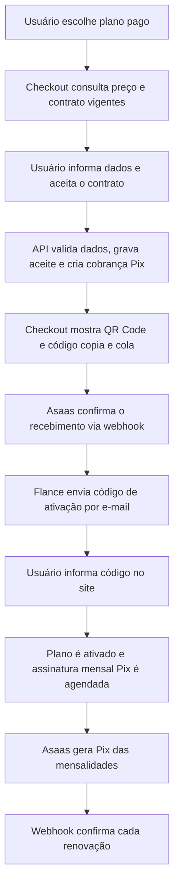

# Pagamentos — Asaas (Pix) com assinatura mensal no dia da ativação

Este documento descreve o fluxo implementado pelo checkout do Flance, a integração com o Asaas e a gestão da assinatura após a contratação. A escolha de um plano pago não ativa benefícios nem cria uma cobrança por si só; isso acontece no checkout e a ativação depende da confirmação do Pix.

## Ciclo completo da contratação



### O que ocorre em cada etapa

1. **Seleção e preço:** a tela `/profile?plan=...` conserva a seleção até o checkout. `/v1/payments/quote` devolve preço inicial, preço recorrente e data estimada; o navegador não define o valor cobrado.
2. **Contrato e pagador:** `/checkout` busca o contrato vigente, versão e hash. O usuário precisa aceitar essa versão e informar nome, e-mail verificado da conta e CPF válido. A API valida os dados, grava a prova do aceite (texto/hash, IP, navegador e data) e armazena o CPF criptografado.
3. **Criação do Pix:** `POST /v1/payments/create` cria uma cobrança `INITIAL` no estado `PENDING`, registra uma chave de idempotência e solicita ao Asaas o QR Code e o código copia e cola. Repetir a chamada com a mesma `Idempotency-Key` recupera a mesma cobrança, sem criar outra.
4. **Confirmação:** o Asaas envia eventos para `/v1/payments/webhook`. Para considerar pago, a API consulta o pagamento diretamente no Asaas e confere estado liquidado, valor, cliente e referência externa. A transição para `PAID` é atômica e idempotente. Enquanto o webhook não chega, consultar `/v1/payments/:id` também sincroniza o estado como contingência.
5. **Ativação:** após a confirmação do pagamento inicial, o Flance envia um código de 6 dígitos ao e-mail. Ele expira em 30 minutos, permite até 5 tentativas e pode ser reenviado respeitando o limite e intervalo informados pela API. O usuário o informa na tela `/checkout?step=code`, que chama `POST /v1/subscriptions/activate`. Só então o plano é ativado.
6. **Renovação:** ao ativar, a API agenda no Asaas a assinatura mensal com Pix. O ciclo começa na ativação; o vencimento mensal usa o mesmo dia (limitado ao dia 28 quando necessário). As mensalidades são cobranças Pix individuais: o usuário precisa pagá-las. `PAYMENT_CREATED` registra a fatura `RECURRING` pendente; `PAYMENT_RECEIVED`/`PAYMENT_CONFIRMED` confirma o recebimento e prorroga o acesso sem pedir outro código.
7. **Acompanhamento:** em `/assinatura`, o usuário vê plano, vencimento e Pix em aberto, pode pedir uma renovação manual, cancelar ou reativar a renovação. Cancelar interrompe cobranças futuras, mas mantém o acesso até o fim do período pago. Para pagamentos em atraso há tolerância de 3 dias; depois dela o plano volta ao FREE e a recorrência é cancelada.

O CPF não é devolvido ao navegador depois de salvo. A variável `ASAAS_CPF_ENCRYPTION_KEY` precisa ser mantida estável para que o servidor possa descriptografar o dado quando necessário. Trocar a chave sem migrar os CPFs já salvos impedirá a leitura desses registros.

## Como funciona

1. **Contrato:** no checkout o usuário lê e aceita o contrato (`GET /v1/contracts/subscription`).
   O servidor só cria a cobrança se receber a **versão + hash exatos** do texto exibido e grava a prova
   (`ContractAcceptance`: texto aceito, hash, IP, navegador, data).
2. **1º pagamento (Pix, `kind=INITIAL`):** **valor cheio** do plano, sem proporcional e sem dia fixo no mês.
   O valor é calculado no servidor; o cliente nunca envia preço.
3. **Ativação:** pagamento confirmado → código de 6 dígitos por e-mail (30 min) → plano ativo por **1 mês a partir da ativação**
   (quem demora para digitar o código não perde dias).
4. **Assinatura do Asaas (`POST /v3/subscriptions`, `MONTHLY`, Pix):** criada na ativação, com o primeiro vencimento no
   mesmo dia do mês seguinte. **Dia da renovação = dia da ativação** (de 1 a 28; ativações nos dias 29, 30 e 31 renovam no dia 28).
   O Asaas gera a cobrança de cada mês com antecedência e dispara `PAYMENT_CREATED`; o Flance registra a mensalidade
   (`kind=RECURRING`), avisa por e-mail 5 dias antes do vencimento e mostra o Pix em "Minha assinatura" quando falta pouco.
5. **Pagamento da mensalidade:** renova o plano até o mesmo dia do mês seguinte, sem novo código, com recibo por e-mail.
   Pagar adiantado não perde dias.
6. **Atraso:** 3 dias de tolerância após o vencimento; depois o plano volta ao FREE e a assinatura do Asaas é cancelada.
7. **Cancelamento:** `POST /v1/subscriptions/cancel` remove a assinatura no Asaas (se o Asaas recusar, nada é marcado como cancelado);
   o plano segue até o fim do período pago.

> **Mensal, não "30 dias exatos".** O ciclo da assinatura do Asaas é de calendário: o período vai do dia X de um mês ao dia X do
> seguinte (28 a 31 dias). O Asaas não oferece ciclo de 30 dias corridos.

> **Pix não é débito automático.** Todo mês nasce um Pix que o cliente precisa pagar. Débito automático de verdade
> exigiria cartão de crédito recorrente (ou Pix Automático, a confirmar com o Asaas).

## Comportamento do Asaas (confirmado na documentação)

- A cobrança de cada mês é gerada **cerca de 40 dias antes** do vencimento (`PAYMENT_CREATED` com o campo `subscription`).
  Por isso ela existe localmente bem antes do vencimento; mostramos em "Minha assinatura" só nos últimos 10 dias.
- A **primeira cobrança nasce na criação da assinatura**; o webhook pode chegar antes de gravarmos o id. Logo após criar,
  buscamos as cobranças geradas (`GET /subscriptions/{id}/payments`), e a rotina diária reconcilia o que faltar.
- O Asaas **não tem webhooks próprios de assinatura**: tudo vem pelos eventos de cobrança. Eventos que não são de cobrança
  e cobranças que não são do Flance são ignorados com `200`.

## Endpoints

| Método | Rota | Auth | Descrição |
|---|---|---|---|
| GET | `/contracts/subscription` | — | Contrato vigente (texto, versão, hash) |
| GET | `/contracts/subscription/accepted` | JWT | Texto exato que o usuário aceitou |
| GET | `/payments/plans` | — | Planos e preços |
| GET | `/payments/quote?plan=` | — | Simulação do 1º pagamento (valor cheio, dia da renovação) |
| POST | `/payments/create` | JWT | Cria o 1º Pix (exige aceite) — header `Idempotency-Key` |
| GET | `/payments/pending-activation` | JWT | Pago e aguardando código (`/checkout?step=code`) |
| GET | `/payments/:id` | JWT | Status + Pix (renova QR expirado; serve 1º Pix e mensalidade) |
| POST | `/payments/:id/activation-code/resend` | JWT | Reenvia o código |
| POST | `/payments/webhook` | token | Eventos do Asaas |
| GET | `/subscriptions/me` | JWT | Plano, próxima renovação, mensalidade em aberto, contrato |
| POST | `/subscriptions/activate` | JWT | Ativa com o código |
| POST | `/subscriptions/renew` | JWT | Devolve a mensalidade em aberto para pagar já |
| POST | `/subscriptions/cancel` · `/reactivate` | JWT | Cancela / reativa a renovação |

Telas: `/checkout`, `/assinatura`, `/contrato`, `/pagamentos`, `/privacidade`, `/meus-dados`.

## Configuração

```env
# Sandbox: chave $aact_hmlg_... + URL abaixo. Produção: chave $aact_prod_... + https://api.asaas.com/v3
ASAAS_API_KEY='$aact_hmlg_...'          # aspas simples por causa do "$"
ASAAS_BASE_URL=https://api-sandbox.asaas.com/v3
ASAAS_WEBHOOK_TOKEN=<openssl rand -hex 32>
ASAAS_CPF_ENCRYPTION_KEY=<openssl rand -hex 32>

# Dados que constam no contrato (obrigatórios em produção)
COMPANY_LEGAL_NAME="Sua Razão Social Ltda"
COMPANY_CNPJ="00.000.000/0001-00"
COMPANY_ADDRESS="Rua X, 123 - Cidade/UF"
COMPANY_SUPPORT_EMAIL=suporte@seudominio.com
COMPANY_PRIVACY_EMAIL=dpo@seudominio.com   # Encarregado de dados (LGPD)
```

> A chave e a URL precisam ser do **mesmo ambiente**: a API recusa (`500`) chave de produção com URL do sandbox.

**Webhook no painel do Asaas** → URL `https://<api>/v1/payments/webhook`, token = `ASAAS_WEBHOOK_TOKEN`,
eventos: `PAYMENT_CREATED`, `PAYMENT_RECEIVED`, `PAYMENT_CONFIRMED`, `PAYMENT_OVERDUE`, `PAYMENT_DELETED`, `PAYMENT_REFUNDED`.
Para testar local use um túnel (ngrok).

**Banco:** `npx prisma migrate deploy`. A migration `20261005120000_billing_asaas_subscription_anniversary` ajusta o modelo
(dia da renovação = dia da ativação). As migrations `...20261004...` e `...20261005...` rodam em sequência.

## Detalhes que evitam cobrança duplicada

- A assinatura é criada com uma trava no banco (`billingSyncLockedAt`): ativação e rotina diária não criam duas.
- A confirmação (`PENDING → PAID`) é atômica: webhook e consulta simultâneos renovam uma vez só.
- O webhook confere valor, cliente e assinatura direto no Asaas antes de renovar qualquer plano.
- Cancelar só marca como cancelado depois que o Asaas confirma a remoção.

## Checklist de produção

```bash
cd apps/api && npm run payments:check   # valida variáveis, par chave/ambiente e consulta o Asaas
```

1. Rotacionar segredos que já circularam (chave Asaas, senha do banco, JWT, SMTP).
2. Variáveis de produção: modelo em `/.env.production.example`.
3. `DIRECT_URL` definida (porta 5432) e `npx prisma migrate deploy`.
4. Webhook no painel de produção do Asaas (URL HTTPS, token, eventos acima).
5. Conta Asaas aprovada, com chave Pix cadastrada.
6. Revisão jurídica do contrato e das políticas.
7. Servidor contínuo (a rotina diária roda dentro do processo; não funciona em serverless).
8. Primeira assinatura real de teste, com reembolso pelo direito de arrependimento.

## Rotina diária (a cada 6h)

Cria no Asaas a assinatura que faltou, busca mensalidades que o webhook perdeu, envia lembrete (5 dias antes) e aviso de atraso,
avisa quem cancelou a renovação que o plano vai terminar e encerra planos após a tolerância. Tudo idempotente.

## Atenção

- **Revisão jurídica:** o texto do contrato (`contracts/subscription-contract.ts`) é um modelo. Ao alterar o texto, mude
  `SUBSCRIPTION_CONTRACT_VERSION`. Mantenha `/pagamentos` e `/privacidade` coerentes.
- **Reembolso** (`PAYMENT_REFUNDED`) marca o pagamento, mas não revoga o plano automaticamente.
- **Troca de plano:** com assinatura ativa não se cria outra; cancele a renovação e assine o outro plano ao fim do período.
- **IP do aceite:** vem de `req.ip`. Atrás de proxy defina `TRUST_PROXY_HOPS=1`.
